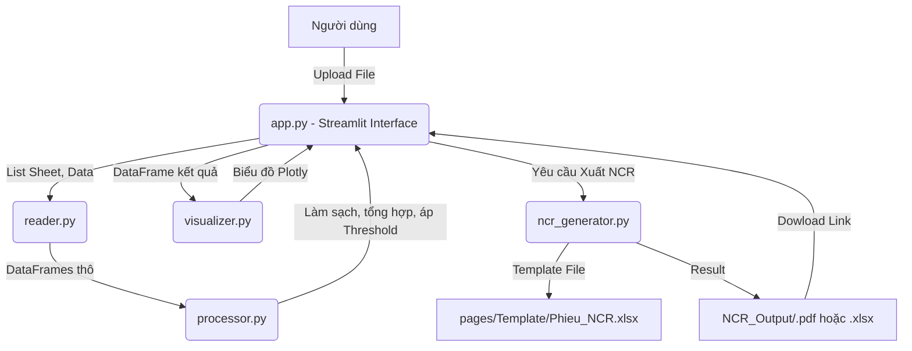

# Kiến trúc dự án: Thống Kê Siêu Âm P2

## 1. Tổng quan Kiến trúc
Dự án được xây dựng dựa trên hướng tiếp cận "Streamlit + Modular Backend scripts". Dữ liệu được tải lên giao diện (Streamlit), sau đó lần lượt dịch chuyển qua các hàm xử lý vòng đời nhằm đảm bảo tốc độ và độ tin cậy. 

## 2. Dòng chảy Dữ Liệu (Data Flow)

## 3. Các thành phần chính

### 1. `app.py` (UI & Controller)
- Điều phối giao diện người dùng. Duy trì Session State (`st.session_state`).
- Xử lý các điều kiện lọc theo Contract, Date, Machine, Supplier.
- Tích hợp toggle Logic chuyển đổi "Tách Đóng Gói / Ẩn Xếp Giựt".

### 2. `reader.py` (ETL Phase 1)
- Chứa các function (như `read_input_file`, `scan_uploaded_files`).
- Nhận dạng file .CSV hoặc .XLSX một cách linh động, gộp chung hoặc trả về dict riêng biệt.

### 3. `processor.py` (ETL Phase 2 & Logic Core)
- Tiến hành xử lý "Old Form Logic" (`process_old_form_logic`).
- Hỗ trợ dò tìm cột lỗi thủ công thông qua "Anchor" thay vì hardcode.
- Tính toán KPI Sản xuất (Tổng Sản Xuất, Roll Repair, Roll Waste, KPI Fail).

### 4. `visualizer.py` (BI Dashboard)
- Tách rời các plot graph về script riêng biệt khỏi UI để giảm tải.
- Sử dụng Plotly nhằm vẽ Sunburst, Pareto, Bar Chart so sánh mức lỗi.

### 5. `ncr_generator.py` & `utils.py` (Reporting Phase)
- Xây dựng file báo cáo theo Template doanh nghiệp nội bộ. 
- Module `utils.py` giúp format text và decode từ các mã trạng thái ghi chú cuộn thành dòng thông báo hiển thị cho người xem (status decode).

## 4. Quản lý trạng thái
- Session State của Streamlit quản trị dữ liệu vòng đời qua các cờ: `data_processed`, `df_result`, `grand_production`, `metadata`, `ncr_bulk_path`, `total_missing_bags`, v.v.
